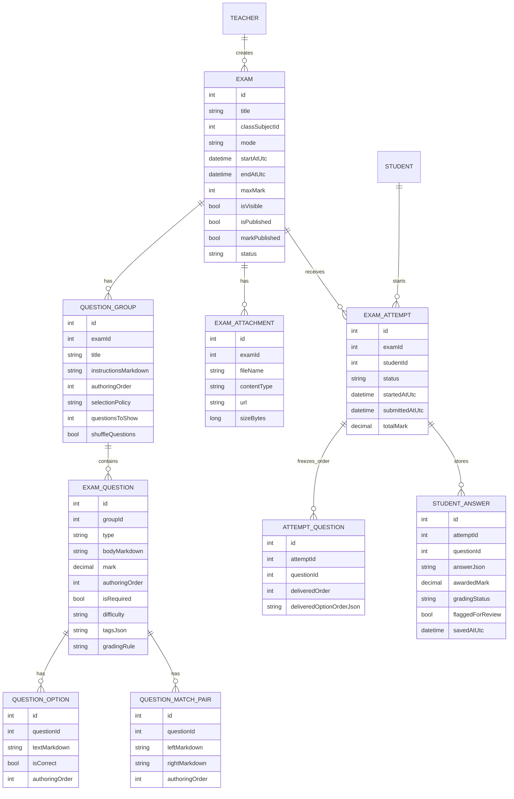
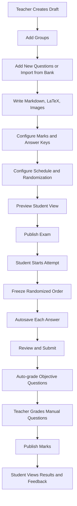
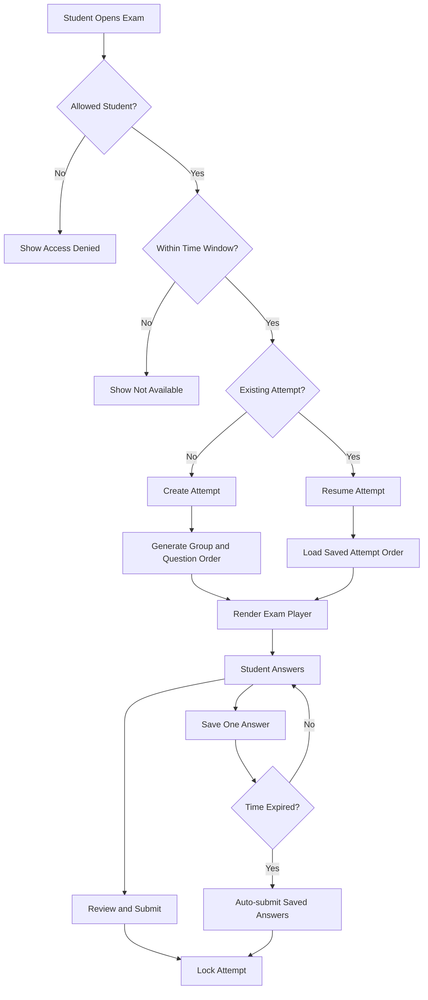

# Exam Engine Design Document

## Summary

The exam engine is a core school-system capability for creating, scheduling, taking, grading, and reviewing exams. It supports online, paper, and mixed exams. Online exams preserve student progress by autosaving each answer independently, so accidental refreshes, browser closes, and temporary connection loss do not erase completed work.

This document is the source of truth for the first exam-engine implementation and future adjustments. It covers product behavior, teacher and student UX, data model, workflows, API surface, test scenarios, and implementation assumptions.

The temporary page designs in `temp/` are design references only. They define the expected screen coverage and visual direction, but they are not production code.

## Key Product Requirements

- Exams support online, paper, and mixed modes.
- Exam content and question text support Markdown, images, and LaTeX math.
- Markdown and math rendering should use established React packages:
  - `react-markdown`
  - `remark-gfm`
  - `remark-math`
  - `rehype-katex`
  - `rehype-sanitize`
  - `katex/dist/katex.min.css`
- Supported question types from v1:
  - multiple choice
  - true/false
  - short answer
  - article/essay
  - file upload
  - matching
  - ordering
  - fill in the blank
- Questions are organized into groups.
- Question order is not fixed for students:
  - authoring order exists only for teacher editing
  - student attempts store the exact delivered order
  - groups, questions, and options can be shuffled
- Student answers autosave one question at a time.
- Attempt progress survives browser close, refresh, and reconnect.
- Submitted or expired attempts are locked.
- Multiple-choice, true/false, matching, ordering, and configured fill-in-the-blank questions can be auto-graded.
- Article, file-upload, and manual short-answer questions are graded by teachers.
- Marks remain hidden from students until the teacher publishes them.

## Teacher Portal UX

### Exam Management Dashboard

The teacher dashboard is the main entry point for exam work.

Required capabilities:

- Search exams by title, subject, class, or teacher-owned metadata.
- Filter exams by status, class, subject, date, and exam type.
- Show status badges:
  - draft
  - scheduled
  - active
  - completed
  - archived
- Show summary metrics:
  - active exams
  - drafts
  - submissions
  - average score
- Support row/card actions:
  - preview
  - edit
  - duplicate
  - archive
  - publish
  - view results

### Exam Builder

Exam creation should be a multi-step workflow:

1. Content and questions
2. Settings and scheduling
3. Review and publish

The builder should include:

- Left question/group navigator.
- Center editor with Markdown and LaTeX authoring.
- Live preview that matches the student display as closely as possible.
- Right settings panel for:
  - question type
  - marks
  - difficulty
  - tags
  - required/optional flag
  - answer key
  - grading rule
- Save draft and publish actions.
- Student preview mode before publishing.

### Question Groups

Question groups reduce cheating and help teachers organize exams by topic, difficulty, or section.

Each group should support:

- Title.
- Optional instructions in Markdown.
- Authoring order.
- Selection policy:
  - show all questions
  - pick N random questions
- Shuffle setting for questions in the group.
- Optional group-level mark summary.

Example groups:

- `Algebra Easy`: pick 5 of 10.
- `Geometry Proofs`: pick 1 of 3.
- `Vocabulary`: shuffle all.

### Question Bank

The question bank is a first-class module, not only an exam sub-feature.

Required capabilities:

- Reusable question library.
- Search questions.
- Filter by subject, type, difficulty, tags, and owner.
- Add selected questions to an exam group.
- Duplicate/import a question into the current exam.
- Preserve original bank questions when imported, unless an explicit shared-edit model is introduced later.

### Add From Bank Modal

The exam builder should support a slide-over or modal for importing bank questions.

Required capabilities:

- Search field.
- Filter controls.
- Selectable question list.
- Selected count.
- Add selected questions to the active group.
- Clear cancel/close behavior without modifying the exam.

### Exam Settings And Scheduling

Required settings:

- Exam mode: online, paper, or mixed.
- Date.
- Start time.
- End time.
- Duration.
- Visibility.
- Publish state.
- Attempt policy.
- Shuffle group order.
- Shuffle questions within groups.
- Shuffle options for supported types.
- File upload accepted formats.
- File upload maximum size.
- Security/focus settings.
- Save draft and publish actions.

## Student Portal UX

### Exams And Quizzes Page

Students need one place to understand what exams are available and what they already completed.

Required capabilities:

- Tabs for:
  - upcoming
  - active
  - completed
- Exam cards with:
  - title
  - subject
  - teacher
  - date
  - duration
  - marks
  - status
- Start or resume action for active exams.
- Completed result access only when marks are published.

### Active Exam Player

The online exam player should prioritize clarity and recovery from mistakes.

Required capabilities:

- Persistent timer.
- Save and exit.
- Question map sidebar.
- Answered, unanswered, and flagged indicators.
- Autosave status.
- Per-question marks and type labels.
- Flag question for review.
- Resume saved attempt.
- Lock submitted or expired attempts.

### Focus Mode

Focus mode is intended for dense article questions or exams where distraction should be minimized.

Required capabilities:

- Reduced navigation and distractions.
- Clear `Focus Mode Active` state.
- Optional split layout:
  - reference material on one side
  - answer area on the other
- Same autosave behavior as the standard exam player.

### File Upload Answer

File upload is a v1 question type and should have explicit answer states.

Required capabilities:

- Drag/drop upload.
- Browse upload.
- Accepted formats shown.
- Maximum size shown.
- Upload progress state.
- Success state with file name, size, and upload time.
- Failed state with recoverable error.
- Replace uploaded file.
- Remove uploaded file.
- Save uploaded file metadata as the answer.

Required file answer states:

- empty
- uploading
- uploaded
- failed
- replaced
- removed

### Review And Submit Page

Online exams should require a review step before final submission.

Required capabilities:

- Answered, flagged, and unanswered summary.
- Question list grouped or marked by status.
- Continue reviewing action.
- Final submit action.
- Final confirmation before locking the attempt.

### Results And Feedback Page

Students can view results only after marks are published.

Required capabilities:

- Total score.
- Time taken.
- Completion date.
- Teacher feedback.
- Question breakdown.
- Correct, incorrect, partial, and manual-grading statuses.
- Study material links if provided by the teacher.

## Content Rendering

Exam instructions, question bodies, group instructions, reference material, and feedback may use Markdown and LaTeX.

Frontend rendering should use `react-markdown` with a controlled plugin pipeline:

- `remark-gfm` for tables, task lists, strikethrough, and common school-document formatting.
- `remark-math` for inline and block math syntax.
- `rehype-katex` for KaTeX-rendered math.
- `rehype-sanitize` with a custom schema.
- `katex/dist/katex.min.css` loaded anywhere exam content is displayed.

Teacher authoring should provide:

- Markdown editor.
- Live preview.
- Image upload/insert button.
- Math examples:
  - inline: `$x^2 + y^2 = z^2$`
  - block:

```text
$$
\frac{a}{b} = c
$$
```

Security rules:

- Do not render unsafe raw HTML by default.
- Sanitize rendered content.
- Restrict uploaded image and attachment file types.
- Enforce upload size limits.

## Data Model



## Core Workflow



## Student Attempt Flow



## Question Type Behavior

- Multiple choice:
  - supports one correct answer initially
  - options can be shuffled per attempt
  - auto-graded
- True/false:
  - stored as objective question with boolean answer
  - auto-graded
- Short answer:
  - manual by default
  - can support exact-match auto-grading when configured
- Article/essay:
  - long text answer
  - manually graded with feedback or rubric
- File upload:
  - answer stores uploaded file metadata
  - manually graded
  - file type and size are restricted
- Matching:
  - student matches left items to right items
  - right-side options can be shuffled
  - auto-graded when exact pairs are defined
- Ordering:
  - student arranges items in the correct sequence
  - auto-graded
- Fill in the blank:
  - supports one or more blanks
  - exact-match or manually graded depending on question settings

## Randomization And Anti-Cheating

Randomization is a required part of the online exam engine.

Supported controls:

- Shuffle group order.
- Shuffle questions inside a group.
- Pick a random subset of questions from a group.
- Shuffle multiple-choice options.
- Shuffle matching right-side options.

Rules:

- Authoring order is used only in the teacher editor.
- Once a student starts an attempt, the delivered order is frozen.
- Grading, review, and result pages must use the frozen attempt order.
- Randomization must not change total marks unexpectedly.
- If a group selects N questions, the teacher must be able to see the resulting possible mark total before publishing.

## Grading And Results

Grading statuses:

- not graded
- auto graded
- needs manual grading
- partially graded
- graded
- marks published

Exam attempt statuses:

- not started
- in progress
- submitted
- expired
- partially graded
- graded
- marks published

Result visibility:

- Teachers can view grading progress before marks are published.
- Students cannot view final marks until `markPublished` is true.
- Students may see submission confirmation before marks are published.

## API Surface

- `POST /api/exams`
- `PUT /api/exams/{id}`
- `POST /api/exams/{id}/groups`
- `PUT /api/groups/{groupId}`
- `POST /api/groups/{groupId}/questions`
- `POST /api/exams/{id}/questions/import-from-bank`
- `POST /api/exams/{id}/attachments`
- `POST /api/exams/{id}/preview`
- `POST /api/exams/{id}/publish`
- `POST /api/exams/{id}/archive`
- `POST /api/exams/{id}/duplicate`
- `GET /api/question-bank`
- `POST /api/question-bank`
- `POST /api/exams/{id}/attempts`
- `PUT /api/attempts/{attemptId}/answers/{questionId}`
- `POST /api/attempts/{attemptId}/answers/{questionId}/files`
- `POST /api/attempts/{attemptId}/submit`
- `GET /api/exams/{id}/grading`
- `PUT /api/answers/{answerId}/grade`
- `POST /api/exams/{id}/publish-marks`

## Implementation Assumptions

- The implementation should follow the current modular architecture documentation.
- Backend implementation should use an `Exams` module and a first-class `QuestionBank` capability.
- Frontend implementation should use feature modules under `client/src/modules`.
- Online exams use one attempt per student by default.
- Retakes require explicit teacher or admin approval.
- Attempt randomization is frozen when the attempt starts.
- Times should be stored in UTC and displayed in the school timezone.
- Raw HTML should be disabled or sanitized.
- File uploads require server-side validation, not only frontend checks.
- The `temp/academic_precision/DESIGN.md` design direction should guide UI:
  - quiet, dense, professional layouts
  - Inter typography
  - low-contrast borders
  - compact tables
  - restrained indigo/slate accents

## Test Scenarios

- Teacher creates an exam with groups, Markdown, LaTeX, images, and all v1 question types.
- Teacher imports questions from the question bank into a specific group.
- Teacher previews the exam before publishing.
- Teacher duplicates an exam.
- Teacher archives an old exam.
- Two students receive different shuffled orders, and each attempt preserves its own order.
- Student flags questions and sees them on the review page.
- Student uploads a valid file and replaces it before submission.
- Invalid file type or oversized file is rejected clearly.
- Autosaved answers survive browser close and reopen.
- Expired attempts auto-submit saved answers.
- Submitted attempts are locked.
- Objective question types auto-grade correctly.
- Manual question types appear in teacher grading.
- Marks remain hidden until published.
- Results page shows score, feedback, time taken, and question breakdown.
- Paper exam allows teacher mark entry without online student attempts.

## Future Adjustment Notes

Before changing implementation behavior, update this document with:

- the reason for the change
- affected user flows
- affected data model or API contracts
- migration needs, if any
- test scenarios that must be added or changed
